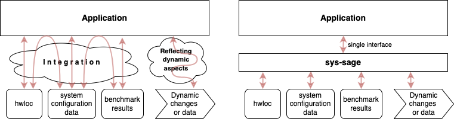
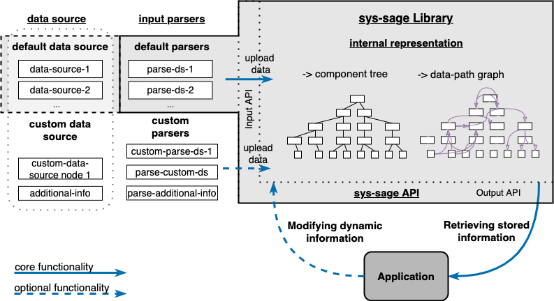

# Concept

The main goal of the library is to to store, update, and provide all relevant information about **hardware topology, dynamic system state/configuration, system capabilities, and other data related to HW from different data sources logically connected to each other**.

## Defining the functionality

#### sys-sage vs. hwloc
sys-sage can be considered an extension to hwloc; it targets the aspects of system topology and HW-related information that are not covered by hwloc.
Hwloc is limited to (among otehrs)
- Providing static data (only given HW topology)
    - Modern systems are not strictly hierarchical anymore
    - Information regarding data movement capabilities is missing
- Difficult to incorporate complementary information
- Mainly CPU-centric

#### What sys-sage Addresses
On the top of hwloc functionality, sys-sage targets
- **The dynamic aspects of modern HPC systems**
    - Data movement information
    - Variable system characteristics
- **Managing arbitrary systems including state-of-the-art architectures**
    - heterogeneous components (CPU, GPU, ..)
    - Interconnets / buses connecting the components
- **High variability in storing and using the data**
    - Different set of information needed ind ifferent use-cases
    - sys-sage enables representing an entity from a single chip up to a whole HPC system with custom level of detail )
    - Arbitrary data can be added to already existing representation
    - sys-sage can store/maintain/provide arbitrary information out-of-the-box, i.e. the user is free to define the stored parameters

#### Possible Areas of Usage

sys-sage is designed to be very versatile, so that it can be integrated to work in many different areas. Thanks the variability, the users can use the fitting set of information for various use-cases.

Some of the areas may include:
- Job / thread scheduling, co-scheduling multiple applications
- Autotuning tasks / applications
- Data management on heterogeneous memory systems (allocation decisions)
- Power management
- Performance optimization, performance modelling tools
- ...and many others

#### Functionality scope

The library aims at storing, and providing the data to the user, not necessarily at the data collection.
Nevertheless, it also provides a set of so-called Default Data Sources which provide the often-used set of information out-of-the-box.
It can represent the dynamic state of the system and increases the degree of detail compared to static hardware topology views.

#### Types of Attributes to Handle
1. Both qualitative (such as core ID) and quantitative (cache size) attributes.
2. Information describing one particular component (L1 cache), their group
(socket), or relation between them (CPU-GPU bandwidth).
3. Both static (theoretical peak bandwidth) and dynamic variable (currently
measured bandwidth) information.
4. Data to describe the hardware (CPU cores), the configuration of a system
(hyperthreading enabled), or its current state (wattage on CPU).
5. Both system-centric (containing information about all system resources) and application-centric (containing information about the resources available to
or used by a particular application/process/user).
6. Application-relevant observations (current memory occupancy, monitoring
data, ...).

#### Workflow
The general workflow is as follows:

***The "User" is usually an application, a resource manager, or any other program***
1. The user specifies which data to upload to the library, choosing either from provided or custom (self-made) data sets. This will create an initial state in sys-sage. Data from multiple sources will be put together and create a single representation of system-related information. (*mainly through input parsers, also possible via the API*)
2. Then, the user requests the stored data from the library. (*through sys-sage API*)
3. Alternatively, the user may use sys-sage in an interactive mode. This means, he would both update/store new data to modify/extend the current representation, and he would also request the data again in order to react to it. (*through sys-sage API*)
4. Finally, the user can dump the contents in an XML file. (This can be done at any point, even repeatedly.) (*through sys-sage XML export functionality*)

## Design of sys-sage

The design of sys-sage reflects the requirements put on it. It is implemented in C++, where the particular constructs are implemented as C++ classes in the background.

There are three main parts of sys-sage:
- Data Sources
- Input Parsers
- Internal Representation

#### Data Sources
The Data Sources are programs capable of generating some information relevant to sys-sage.
The generated files (or other information sources) contain raw information to upload to the library.
There are two types of data sources:
1. Default Data Sources and
2. Custom Data Sources.

The Default Data Sources are Data Sources that come as a part of sys-sage (see the [Installation Guide](Installation_Guide.md) for options of building sys-sage with/without Default Data Sources).
The goal is to provide the frequently-used information to users out-of-the-box so that they do not need to implement anything.

The Custom Data Sources are data generated by the user’s own (custom) measurements, observations, or findings.
There is no limitation on what can and cannot be a Custom Data Source, the user is free to upload any (even remotely) HW-related information to sys-sage.
Custom Data Sources are not a part of the core of sys-sage but the users can easily make them a part of their workflow.

#### Input Parsers
Input Parsers are responsible for uploading the Data Sources into sys-sage.
They read the Data Sources and transfer them to structures recognized by the library’s internal representation.
Analogously to Data Sources, there are two types of Input Parsers:
1. Default Input Parsers and
2. Custom Input Parsers.

Default Parsers are a part of sys-sage and enable a simple out-of-the-box parsing and uploading of Default Data Sources.
Custom Parsers are user extensions to parse their Custom Data Sources.
Alternatively, a custom parser can be written by the user to parse a default Data Source in a custom way.
For instance, if the user is interested (for the sake of his use-case) in the hwloc output only on the NUMA-granularity, he can write a parser that would ignore the deeper layers provided by hwloc.

### Internal Representation
Internal Representation is the central part of the library that defines the components of the system as well as their logical relation, and the functionalities available through the API. It combines all data together in one logical representation and enables the connection between the different parts of the system as well as different types of information, while also targetting at easy orientation in the internal structure.

We represent an HPC system in sys-sage in the form of Components, their hierarchical physical structure (that we call Component Tree), and [Data Paths](class_data_path.html), which reflect additional relations and attributes between Components that go beyond the tree structure and can also reflect dynamic properties.
Data Paths form a Data-path Graph, which captures information that can be orthogonal to the information in the Component Tree, which mainly represents the static physical composition of the system.
Both the Component Tree and the Data-path Graph can be modified at runtime, allowing sys-sage to capture changing characteristics of a system.

Usually, a user would use Components to store some qualities of a part of a system (such as cache size, memory technology, CPU frequency, node id...).
Data Paths would be used to express a relation between two Components (such as bandwidth from a core to a cache/memory, or core-specific cache partitioning settings)

#### Components and Component Tree

The Component Tree is the mandatory part of the sys-sage design, which resembles the topology overview provided by hwloc.

An HPC system is composed of mul- tiple (physical or logical) elements that we call Components.
Components have hierarchical relations to each other, which we capture in the Component Tree.
It provides a structure that is easy to understand for the user and is easy to navigate in.
It represents the physical relation of the Components.

There are multiple **Component Types** that are derived from different (physical or logical) parts of the system so that their specific attributes can be represented.
There are the following Component Types available:
– **Component**: default generic type with no special attributes.
– **Topology**: the root of an HPC system.
– **Node**: HPC system nodes.
– **Chip**: a building block of a node. It may represent a CPU socket, a GPU, a NIC or any other chip.
– **Subdivision**: a generic grouping within the system.
– **NUMA**: NUMA regions are special and frequently-occurring case of subdivisions grouping memory locations.
– **Cache**: different levels of caches.
– **Core**: a physical processing core on a CPU or a block of compute units (GPU streaming multiprocessor).
– **Thread**: a hardware thread, i.e., what a Linux OS considers a ‘CPU’. Moreover, it is used to represent a compute unit on other chips (such as GPU threads).
– **Memory**: main/global memory or a part of it regardless of the technology.
– **Storage**: a data storage device.

Each Component shares a set of properties inherited from the generic *Component*.
On the top, there are additional specific properties depending on the *Component Type*.
Regardless of that, an arbitrary piece of information can be stored to each Component -- it is done by using its **attrib** map.
It is a std::map carrying a pointer; that means a user defines his key, attaches pointer to any structure, and can access the data later on.

Refer to the [API documentation on Components](class_component.html) for more information.

#### Data Paths and Data-path Graph
A Data Path is a construct that carries information about the relation of two arbitrary Components.
The set of Data Paths forms a Data-path Graph.
Each Data Path has a **source** and a **target Component**, but apart from that, no other rules apply.
Data Paths may be oriented (differentiating between the source and the target) or bidirectional.
There may also be multiple Data Paths connecting the same pair of Components, enabling the representation of multiple dependencies or relationships.
To differentiate between these, attribute ‘dp_type’ is used to easily group or tell apart different kinds of information carried by Data Paths.

Analogously to Components, Data Paths have a set of default properties, such as bandwidth or latency, and an std::map **attrib**, where arbitrary information can be attached.
Data Paths may carry all different kinds of information, including but not limited to performance-related or power consumption-related information, or even application-specific data

The Data Paths are associated with Components they refer to – each Component contains pointers to all Data Paths associated with it; and each Data Path includes pointers to source and target Components.
In a usual use-case, one would use the Component Tree to locate Data Paths related to a part of the system.

Refer to the [API documentation on Data Paths](class_data_path.html) for more information.
